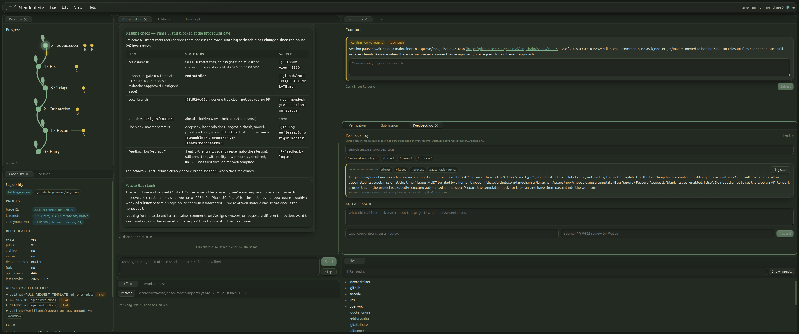

# Mendophyte

[](https://github.com/Berniebiloxi/mendophyte/actions/workflows/ci.yml)
[](CHANGELOG.md)
[](https://berniebiloxi.github.io/mendophyte/)

A local cockpit for contributing to open-source projects with an AI agent
that teaches while it works. Built on the Claude Agent SDK, runs on your
machine against your own Claude Code login. No hosting, no account.



## What it does

- **Walks a real contribution end to end.** Entry, recon, orientation,
  triage, fix, submission, following a six-file meta-prompt the agent reads
  and you can read too (`prompts/`).
- **Keeps the learning on your side.** The agent hands work back at fixed
  points: your hypothesis before it shows a diff, your failing test, your
  PR description. Those land in **Your turn** as cards.
- **Never does anything irreversible without you.** Commits, pushes, PRs,
  issues, comments, history rewrites and recursive deletes pause in a
  confirmation modal showing the exact command.
- **Shows the evidence, not claims.** Verification runs real commands and
  reports real exit codes. Benchmarks are distributions with noise checks.
  The forge is queried, not assumed.
- **Leaves a paper trail outside the repo.** Six notes (Artifacts A–F),
  session snapshots and a feedback log live in `~/.mendophyte/<repo>/`,
  and the agent reads them when you come back.

## Requirements

| Need | Why |
|---|---|
| Node.js 20.19+ (22 recommended) | runs the local server |
| Claude Code, logged in (`claude` works in a terminal) | Mendophyte runs sessions through your own account |
| git and a clone of the project you want to help | the agent works in that clone |
| GitHub CLI, logged in (`gh auth login`), optional | moves the capability tier from *partial* to *full forge access* |
| Linux only: `python3` + a C++ toolchain | the terminal panel's native dependency compiles from source there |

## Install

```
git clone https://github.com/Berniebiloxi/mendophyte.git
cd mendophyte
npm ci
npm start
```

`npm start` serves `http://localhost:4317` and opens your browser. To look
around without spending tokens: `MENDOPHYTE_FAKE_SESSION=1 npm start`.

## Update

```
cd mendophyte
git pull
npm ci
npm start -- --replace
```

`--replace` asks the running instance to shut down and starts the new
code in its place. Sessions end (their notes stay on disk); reopen the
project from **File → Open project…**. See [CHANGELOG.md](CHANGELOG.md)
for what changed.

## Using it

1. **Session** panel → paste the absolute path of your clone → **Start
   session**. Leave the model blank for your Claude Code default.
2. Pre-flight runs (forge access, repo health, AI-policy files, prior
   notes) and is handed to the agent, which asks two gating questions.
   Answer them in **Your turn**.
3. From there the agent follows the phases. Anything it needs from you is
   a card in **Your turn**; anything irreversible is a modal. When it asks
   with Claude Code's question tool, you get clickable options.
4. Coming back later: **File → Open project…** lists every repository you
   have worked on. The agent reads its own notes and asks how to continue.

## The controls

| Where | What |
|---|---|
| **File → Open project…** | reopen a repository; the agent resumes from its notes |
| **File → Save snapshot / Export session…** | a Markdown record of the session, into the notes folder or as a download |
| **File → Quit Mendophyte** | stops the server and frees the port |
| **Edit → Interrupt agent** | stops the current turn; greyed out when the agent is idle |
| **View → Panels** | open and close panels with a checkmark each |
| **View → Layout** | workflow presets, *Follow the phase*, your saved layouts |
| **View → Appearance** | Vine or Minimal theme, light/dark, fonts |
| **View → UI size** | one number scales the whole app; *Auto* picks by screen |
| **Help → Debug log** | the per-run log file, with *Mark this moment* and download |

## The panels

| Panel | Shows |
|---|---|
| Progress | the vine: phases 0–5, the current one glowing, artifact buds lighting as notes appear |
| Conversation | the agent's replies rendered (headings become boxes, tables render), your messages, turn timing |
| Your turn | the queue of things only you can answer, plus the agent's question cards |
| Triage | Phase 3 as a board: candidates with the named criteria, then the chosen task with its danger gauge |
| Diff | the real working-tree diff; locked until you have stated your hypothesis |
| Verification | the project's own checks, detected and run, with real exit codes and logs |
| Submission | the PR for the branch, CI, template compliance, DCO, branch sync |
| Benchmark | performance sessions: baseline vs after as distributions with a noise-aware verdict |
| Files | tracked files with a fragility heat overlay; click to read |
| Artifacts | notes A–F and session snapshots, rendered, with find |
| Feedback log | durable lessons from real review, append-only, searchable |
| Capability | the pre-flight facts: forge tier, repo health, AI policy files, local machine |
| Terminal | your own shell in the clone (not the agent's, not gated) |
| Transcript | every event, including raw SDK messages if you want them |
| Debug log | the running log file for this server run |

## When something looks wrong

| Symptom | Do this |
|---|---|
| Anything at all | **Help → Debug log → Mark this moment**, then send the file. It records every request, event, click and error, with tokens redacted. |
| "Mendophyte is already running at …" | `npm start -- --replace` (or `--stop`, or `--port <other>`) |
| The agent seems stuck | the menubar says *working* while a turn runs; the conversation streams text as it arrives; each finished turn shows how long it took and how much was waiting on you |
| No first turn ever arrives | run `claude` in a terminal and make sure it is logged in |
| Terminal stopped taking input | its tag says *reconnecting* if the socket dropped; it reconnects on its own |
| `npm install` fails on node-pty (Linux) | `sudo apt install build-essential python3`, then rerun; everything but the terminal works without it |
| The app looks different after reopening | always open `http://localhost:4317` (the numeric address is redirected); browsers keep zoom and settings per address |
| Text looks wrong on Windows | bundled fonts are on by default there; **View → Appearance → Fonts** switches |

## Where things live

| Path | Contents |
|---|---|
| `~/.mendophyte/<repo>/` | Artifacts A–F, `snapshots/`, `benchmarks/`, `logs/`, `project.json` |
| `~/.mendophyte/logs/` | one debug log per server run |
| `prompts/` | the six meta-prompt files, verbatim |
| `docs/handoff.md` | the original brief and architecture decisions |
| `docs/ARCHITECTURE.md` | server API, orchestration layer from the terminal, project layout, developing the UI |

## Development

```
npm run dev              # server with real sessions
npm run dev:web          # vite on :5173, proxied to the server
npm test                 # unit tests
npm run test:browser     # drives the built UI in a local Chrome; screenshots in test/browser/shots/
npm run test:live        # against real Claude Code sessions (haiku, a few cents)
```

CI runs the unit suite on Linux, macOS and Windows and the browser
walkthrough on Linux and Windows, uploading screenshots from each.
Details in [docs/ARCHITECTURE.md](docs/ARCHITECTURE.md).

## License

MIT.
